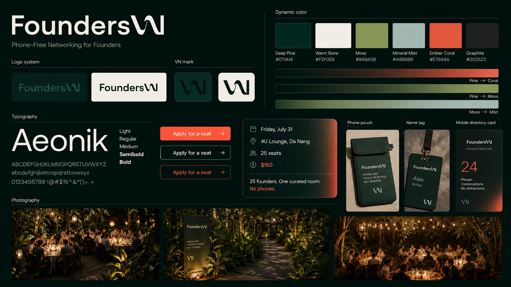

# FoundersVN Brand System

_English-first design brief. Vietnamese localization comes later._

## 1. Brand Idea

FoundersVN is a curated, phone-free dinner for founders and business owners in Vietnam.

It is not a crowded meetup, not a corporate networking event, and not a membership-club landing page. It should feel like being invited into a calm, intentional room where the right people are already present.

Core line:

> Phone-Free Networking for Founders

Supporting line:

> An intimate founder dinner in Da Nang, designed for deeper conversations and quietly supported by technology so every introduction feels natural.

## 2. Event Context

| Detail | Direction |
|---|---|
| Brand | FoundersVN |
| Tagline | Phone-Free Networking for Founders |
| First edition | Da Nang |
| Date | Friday, July 31, 2026 |
| Venue | 4U Lounge, Da Nang |
| Capacity | 25 seats |
| Ticket | $150 |
| Format | Curated dinner across multiple hosted tables |
| Digital layer | App supports contacts and logistics before, during, and after the event |

Important: do not frame this as a one-table event. The experience is a curated room with multiple hosted tables.

## 3. Brand Feeling

The brand should feel:

- calm but powerful
- premium but not flashy
- young but not trendy
- modern but not SaaS-like
- hosted, human, and intentional
- selective without feeling arrogant
- dynamic without feeling loud

Think: premium hospitality, editorial atmosphere, private dinner, real conversations.

Do not think: conference, coworking event, crypto party, luxury club, or startup pitch night.

## 4. Visual World

Start with image and atmosphere.

Use:

- cinematic twilight
- deep forest canopy
- warm table light from the venue
- richer gradients and color transitions
- moving hero video as the first web impression
- multiple small tables
- people leaning in, listening, speaking calmly
- real venue details: wood, glass, stone, linen, candles
- subtle phone pouches or check-in ritual
- Da Nang atmosphere through coastline, mountain silhouettes, warm outdoor air

Avoid:

- one long communal table as the main promise
- generic handshake photography
- obvious AI fantasy details
- purple-blue gradients
- blockchain nodes, coins, or Web3 symbols
- nightclub energy
- luxury serif cliches
- overly busy UI overlays
- pale, static, washed-out palette use

## 5. Color System

| Role | Name | Hex | Use |
|---|---|---:|---|
| Primary dark | Deep Pine | `#071A14` | Main background, hero overlay, dark UI |
| Warm base | Warm Bone | `#F2F0E8` | Text on dark, print base, calm surfaces |
| Organic accent | Moss | `#8A9A5B` | Labels, quiet highlights, progress |
| Soft secondary | Mineral Mist | `#A9BBB6` | Muted text, borders, metadata |
| Action | Ember Coral | `#E7644A` | CTA only |
| Neutral | Graphite | `#202522` | Text on light surfaces |
| Dynamic transition | Pine to Coral | `#071A14` → `#E7644A` | Hero overlays, CTA hover, scarcity moments |
| Dynamic transition | Pine to Moss | `#071A14` → `#8A9A5B` | Image washes, quiet depth |
| Dynamic transition | Moss to Mist | `#8A9A5B` → `#A9BBB6` | UI rails, progress, subtle glows |

Rules:

- Deep Pine carries the brand.
- Ember Coral is the only high-energy accent. Use it for action, scarcity, and controlled dynamic transitions.
- Keep contrast high enough for web readability.
- Do not let the palette become a flat all-green system.
- Use gradients as atmosphere, not decoration. They should feel like light moving through the room.
- Avoid pale blocks as the dominant impression. Warm Bone is for breathing space, not the main mood.
- Do not use gold as a brand color. It pushes the system toward luxury restaurant instead of modern founder dinner.

## 6. Typography

Direction: refined geometric sans.

Recommended:

- Display: Satoshi, General Sans, Neue Haas Grotesk Display, or similar
- Body/UI: Inter, Satoshi, or similar

Rules:

- No serif-as-premium shortcut.
- No negative letter spacing.
- Use large, airy hero typography.
- Keep body copy short and calm.
- Test Vietnamese diacritics before localization.

## 7. Logo System

Current direction: wordmark-first.

Use only the agreed logo direction:

- full `FoundersVN` wordmark for web, invitations, and primary materials
- VN/wavy mark for favicon, social avatar, pouch, ticket, and small details
- light mark on Deep Pine
- dark mark on Warm Bone

Existing assets:

- `../assets/brand/founders-vn-logo.svg`
- `../assets/brand/founders-vn-wavy.svg`
- `../assets/brand/founders-vn-wavy-icon-rounded-square-2048.png`

Rules:

- Keep logo usage spacious.
- Use the actual SVG files in web builds. Do not recreate the logo with live text.
- Do not invent new logo marks.
- Do not replace the VN/wavy mark with triangles, trees, mountains, arrows, or abstract icons.
- Do not add gradients.
- Do not over-repeat the symbol as decoration.
- Do not make the mark feel like a generic app icon.

## 8. Website Direction

The website should be cinematic, dynamic, and still edited down.

Hero structure:

- full-bleed hero video from `../tools/hero-video/out/hero.webm` / `hero.mp4`
- simple top navigation
- large English headline
- short supporting copy
- one primary CTA
- one subtle secondary link
- one event information panel
- a quiet hint of the next section below the fold
- dynamic pine/coral/moss overlays for depth and legibility

Avoid:

- attendee portrait strips in the hero
- too many cards
- dense UI dashboards
- fake profile data
- long bilingual copy in the first pass
- trying to explain everything above the fold
- invented logo marks
- static pale hero sections

Suggested hero copy:

| Element | Copy |
|---|---|
| Eyebrow | Da Nang · Friday, July 31 · 4U Lounge |
| Tagline | Phone-Free Networking for Founders |
| H1 | Phone-Free Networking for Founders |
| Subhead | An intimate founder dinner in Da Nang, designed for deeper conversations and quietly supported by technology so every introduction feels natural. |
| CTA | Apply for a seat |
| Secondary | How it works |

Event panel:

- Friday 31/07/2026
- 4U Lounge, Da Nang
- 25 seats
- $150

Bottom hint:

- Know the room
- Hosted tables
- Follow up after

## 9. Layout Rules

Use negative space.

Design rules:

- keep hero copy directly on image, not inside a card
- use only one strong CTA
- keep the event panel compact
- cards should be low-profile and limited
- radius should be restrained: 6-8px
- borders should be thin and quiet
- glass overlays should feel editorial, not dashboard-like
- every section needs one clear job

The page should feel expensive because it is edited down.

## 10. Imagery Direction

Photography should be documentary and atmospheric.

Shot list:

- wide venue shot with multiple tables
- small table conversations
- phone pouch/check-in ritual
- host welcoming the room
- hands, table details, candles, menus, name tags
- attendees listening, not posing
- environmental portraits
- post-event group shot only as secondary proof

Editing:

- deep shadows
- warm highlights
- natural skin tones
- no HDR harshness
- no fake bokeh blobs
- no AI-looking surreal props

## 11. UI Components

### CTA

Text: `Apply for a seat`

Style:

- Ember Coral fill
- Warm Bone text
- simple arrow optional
- no gradient
- no oversized pill

### Event Panel

Content:

- date
- venue
- capacity
- price

Style:

- dark translucent surface
- Mineral Mist border
- small Moss icon/line accents
- compact vertical rhythm

### Step/Hints

Use three simple statements:

- Know the room
- Hosted tables
- Follow up after

Do not use full explanatory cards in the hero.

## 12. Voice

Voice should be:

- direct
- composed
- warm
- selective
- peer-to-peer

Use:

- curated room
- hosted tables
- phone-free
- know the room before you arrive
- conversations worth continuing

Avoid:

- visionary
- elite
- high-level people
- exclusive club
- networking xịn
- luxury language
- hard-sell urgency

## 13. Application Across Touchpoints

### Web

Lead with image and restraint.

### Social

Use one strong line over atmospheric photography:

- Phone-Free Networking for Founders
- The app handles the logistics. You stay present in the conversation.
- Fewer people. Better fit. Deeper conversations.

### Print

Use Warm Bone + Deep Pine with small Moss or Ember Coral details.

Touchpoints:

- invitation
- ticket
- name tag
- table card
- phone pouch card
- post-event follow-up card

### Directory/App

The app should feel like a private event companion, not a social feed.

Prioritize:

- attendee profile
- what they do
- what they are looking for
- what they can offer
- language comfort
- save/contact

Avoid heavy feeds, chat-first design, or industry-heavy filters.

## 14. Designer Checklist

Before finalizing:

- Is it English-first?
- Is it minimal enough?
- Does the image do most of the emotional work?
- Does it use the agreed FoundersVN wordmark and VN/wavy mark?
- Does it show or imply multiple hosted tables?
- Is the date Friday, July 31, 2026?
- Is the CTA clear and singular?
- Does it avoid membership, cruise, and monthly-club language?
- Does it feel like premium hospitality rather than SaaS?
- Does it feel calm enough to be phone-free?
