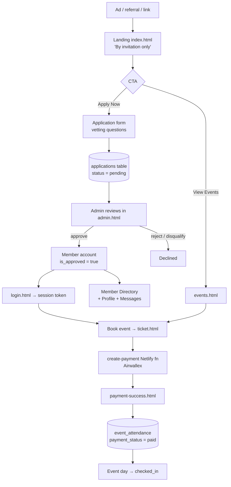
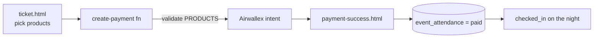

# User Flow — Ben's "Founders Vietnam" (as built)

_How a real user moves through the site today: acquisition → application → auth → booking → payment → the connection app._

## The whole journey (high level)

## 1. Acquisition → Application (public)
- Landing sells scarcity/prestige: "**Where Visionaries Converge**", "By invitation only", cap stats, real dinner gallery, membership tiers.
- Primary CTA **"Apply Now"** opens the application modal (also `#apply`).
- **Application form fields:** name, email, age, social link, company, role, industry, **revenue, team size**, biggest challenge, unique value, 12-month goals, why join, referral (+ referrer), event interest, membership type, commitment checkbox.
- Submit → row in `applications` (`status = pending`). RLS lets anyone insert. **No payment at this step.**

## 2. Vetting (admin)
- Admin opens `admin.html`, reviews applications, sets **approved / rejected / disqualified**.
- Approval provisions a `members` record (`is_approved = true`). This is the **quality gate** that makes the room feel curated.

## 3. Auth (member)
- `login.html` + `auth.js`: custom auth against `members` (bcrypt), issues a **session token** stored in `sessions`. Gated pages check the session.

## 4. Event booking → payment
- From `events.html` (spots-remaining shown) or a "Book" CTA → `ticket.html`.
- Ticket page assembles **`productIds`** (e.g. `founding-dinner` + optional `plus-one-dinner`, `vip-upgrade`).
- Calls **`/.netlify/functions/create-payment`** → prices **re-validated server-side** → Airwallex payment intent → returns `clientSecret`.
- On success, Airwallex redirects to **`payment-success.html?order=…`**; attendance recorded in `event_attendance` (`payment_status = paid`).
- **Refund:** `process-refund` Netlify function + `refund.html` policy.
- **Check-in:** `event_attendance.checked_in` flips on event day (admin/QR).

## 5. The connection app (member-only)
- **`members.html` (directory):** search by name/company/industry; filter tags by **industry**; cards show avatar, name, role, company, industry, one-line bio, and **direct contact icons (WhatsApp / Telegram / Zalo / LinkedIn)**; "View Full Profile". Non-members see a **locked** state → nudged to apply.
- **`profile.html`:** each member edits company, role, bio, socials — this is what populates the directory.
- **`messages.html`:** in-app DMs between members.
- RLS: approved members are exposed to the directory query (see security note in [FEEDBACK.md](FEEDBACK.md)).

## 6. Ancillary flows
- **Speak:** `speak.html` → apply to present.
- **Sponsor:** `sponsor.html` → sponsorship packages.
- **Past events:** `past-events.html` → galleries as social proof.

## Forms inventory (what data is collected where)
| Form | Page | Writes to | Gated? |
|---|---|---|---|
| Membership application | `index.html` modal / `#apply` | `applications` | Public |
| Login | `login.html` | `sessions` | Public |
| Profile edit | `profile.html` | `members` | Member |
| Checkout | `ticket.html` | Airwallex + `event_attendance` | Member (usually) |
| Speak | `speak.html` | (form) | Public |
| Sponsor | `sponsor.html` | (form) | Public |
| Message | `messages.html` | messages | Member |
